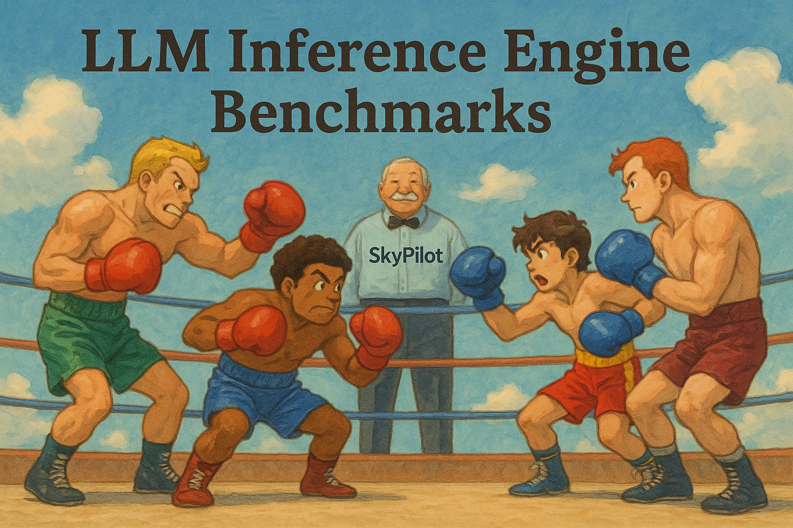

# LLM Inference Engine Benchmarks


This collection of open-source LLM inference engine benchmarks provides **fair and reproducible** one-line commands to compare different inference engines on **identical hardware** on different infrastructures -- your own clouds or kubernetes clusters.

We use [SkyPilot](https://github.com/skypilot-ai/skypilot) YAML to ensure consistent infrastructure deployment across benchmarks.



## Background

When different LLM inference engines start to post their performance numbers [[1](https://x.com/vllm_project/status/1913513173342392596), [2](https://x.com/lmsysorg/status/1913064701313073656)], it can be confusing to see different numbers. It can due to different configurations, or different hardware setup.

This repo is trying to create a centralized place for these benchmarks to be able to run on the same hardware, with the optimal configurations (e.g. TP, DP, etc.) that can be set by the official teams for those inference engines.

Disclaimer: This repo is created for learning, and is not affiliated with any of the inference engine teams.

## Installation

```bash
pip install -U "skypilot[nebius]"
```

Setup cloud credentials. See [SkyPilot docs](https://docs.skypilot.co/en/latest/getting-started/installation.html).


## Version

The version of the inference engines are as follows:

- vLLM: 0.8.4
- SGLang: 0.4.5.post1
- TRT-LLM: NOT SUPPORTED YET

## Benchmark from vLLM

vLLM created a [benchmark](https://github.com/simon-mo/vLLM-Benchmark/tree/main) for vLLM vs SGLang and TRT-LLM.

To run the benchmarks:

> [!NOTE]
> vLLM team runs the benchmarks on Nebius H200 machines, so we use `--cloud nebius` below.


### Run the benchmarks

```bash
cd ./vllm

# Run the benchmarks for vLLM
sky launch --cloud nebius -c benchmark -d benchmark.yaml
  --env HF_TOKEN
  --env MODEL=deepseek-r1
  --env ENGINE=vllm

# Run the benchmarks for SGLang
# Note: the first run of SGLang will have half of the throughput, likely due to
# the JIT code generation. In the benchmark.yaml, we discard the first run and
# run the sweeps again.
sky launch --cloud nebius -c benchmark -d benchmark.yaml
  --env HF_TOKEN
  --env MODEL=deepseek-r1
  --env ENGINE=sgl


# This is not supported yet
# sky launch --cloud nebius -c benchmark benchmark.yaml
#   --env HF_TOKEN
#   --env MODEL=deepseek-r1
#   --env ENGINE=trt
```

Automatically stop the cluster after the benchmarks are done: 

```bash
sky autostop benchmark
```

> [!NOTE]
> If you would like to run the benchmarks on different infrastructure, you can change `--cloud` to other clouds or your kubernetes cluster: `--cloud k8s`.

You can also change the model to one of the following: `deepseek-r1`, `qwq-32b`, `llama-8b`, `llama-3b`, `qwen-1.5b`.

### Benchmark Results for DeepSeek-R1

- **CPU**: Intel(R) Xeon(R) Platinum 8468
- **GPU**: 8x NVIDIA H200

**Output token throughput (tok/s)**

| Input Tokens | Output Tokens | vLLM | SGLang |
| ------------ | ------------- | ------------ | ------------ |
|         1000 |          2000 | 1136.92 | 1041.14 |
|         5000 |          1000 |  857.13 |  821.40 |
|        10000 |           500 |  441.53 |  389.84 |
|        30000 |           100 |   37.07 |   33.94 |
|     sharegpt |      sharegpt | 1330.60 |  981.47 |


**Logs**
- vLLM logs: [vllm_deepseek-r1.log](./vllm/logs/vllm-deepseek-r1.log)
- SGLang logs: [sgl_deepseek-r1.log](./sgl/logs/sgl-deepseek-r1.log)

## Benchmark from SGLang

SGLang created a [benchmark](https://github.com/sgl-project/sglang/issues/5514) for SGLang on random input and output. This benchmark uses the same configurations from it.

### Run the benchmarks

```bash
cd ./sgl

# Run the benchmarks for SGLang
sky launch --cloud nebius -c benchmark benchmark.yaml \
  --env HF_TOKEN \
  --env ENGINE=sgl

# Run the benchmarks for vLLM
sky launch --cloud nebius -c benchmark benchmark.yaml \
  --env HF_TOKEN \
  --env ENGINE=vllm
```

### Benchmark Results for DeepSeek-R1

- **CPU**: Intel(R) Xeon(R) Platinum 8468
- **GPU**: 8x NVIDIA H200

**Output token throughput (tok/s)**

| Input Tokens | Output Tokens | vLLM | SGLang |
| ------------ | ------------- | ------------ | ------------ |
|1000 | 2000 | 1052.20    |1165.77 |
|5000 | 1000 | 799.60  | 887.64 |
|10000 | 500 | 436.70  | 433.66 |
|30000 | 100 | 37.82 | 39.37 |

**Logs**
- vLLM logs: [vllm-deepseek-r1.log](./sgl/logs/vllm-deepseek-r1.log)
- SGLang logs: [sgl-deepseek-r1.log](./sgl/logs/sgl-deepseek-r1.log)

**Output token throughput (tok/s): Using 200 prompts (vs 50 prompts in the official benchmark)**

| Input Tokens | Output Tokens | vLLM    | SGLang  |
| ------------ | ------------- | ------- | ------- |
| 1000 | 2000 | 2683.27 | 1040.19 |
| 5000 | 1000 | 1117.89 | 842.14 |
| 10000 | 500 | 347.77 | 457.40 |
| 30000 | 100 | 33.65 | 42.76 |


**Logs**
- vLLM logs: [vllm-deepseek-r1-200.log](./sgl/logs/vllm-deepseek-r1-200.log)
- SGLang logs: [sgl-deepseek-r1-200.log](./sgl/logs/sgl-deepseek-r1-200.log)

## Contribution

Any contributions from the community are welcome, to tune the versions and configurations for different inference engines, so as to make the benchmarks more accurate and fair.


## Final Thoughts

Interestingly, the benchmark results diverge from the vLLM and SGLang's official benchmark results, even with the same hardware, and the same flags.

Although both of the benchmark scripts try to simulate the real inference scenario, the throughput numbers are very sensitive to the benchmark setup -- even simply changing the number of prompts from 50 to 200 can flip the conclusion for the performance of the two engines.

A better benchmark is in need to provide more insights into the performance of inference engines, while this repo could offer a platform for the community to run the benchmarks in a fair and reproducible way, including same settings, same hardware, etc.
